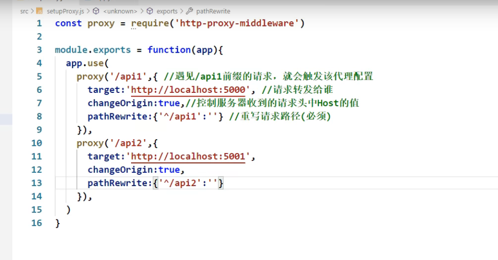
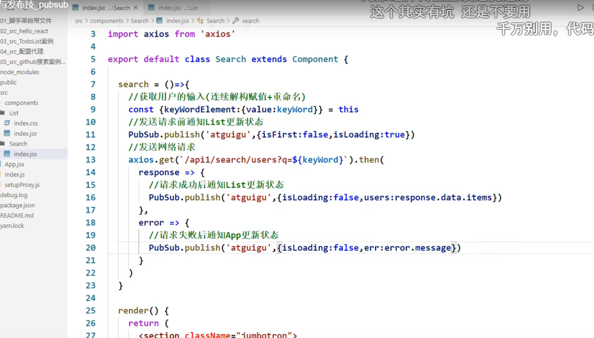
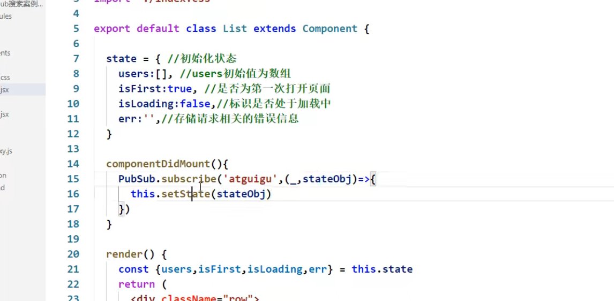
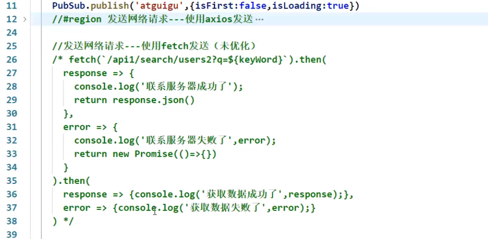
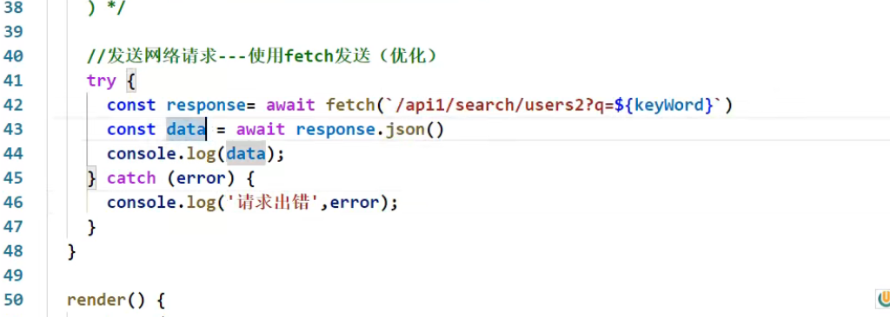
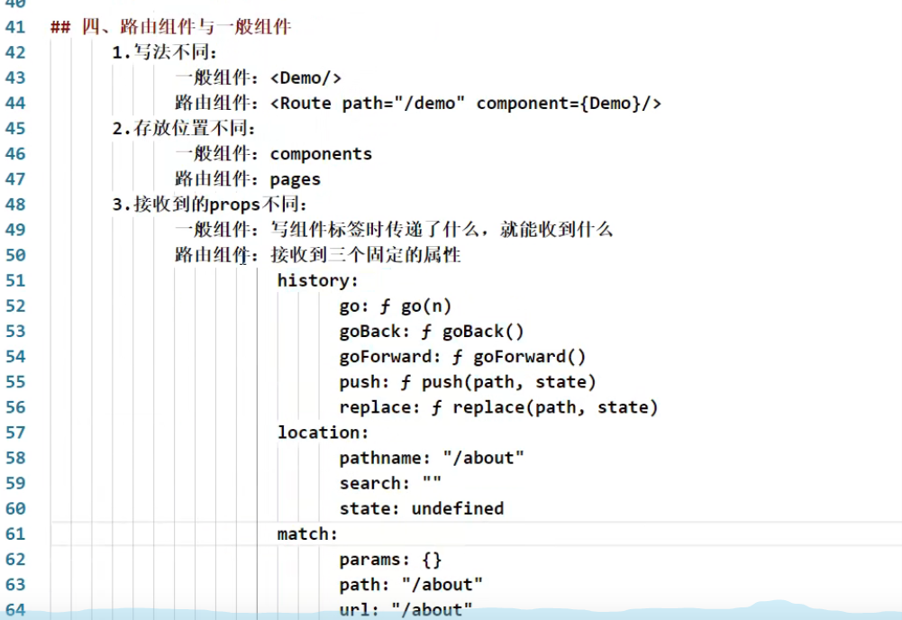
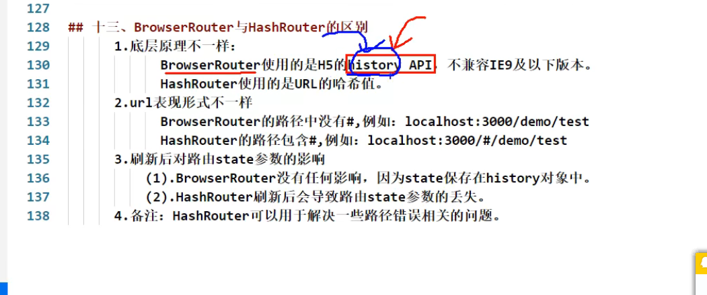

# js创建虚拟DOM（知道就行）

```
document.createElement("标签名"，标签属性，标签内容)
标签属性为对象
标签内容可以嵌套
```

# 虚拟DOM是什么

```
是一个js对象
```

# 虚拟DOM与真实DOM的区别

虚拟DOM比较轻，真实DOM比较重因为虚拟DOM是react内部在用无需那麽多属性

虚拟DOM最后会被react转换成真是DOM

# XML

早期用于存储和数据传输

# jsx语法

```
定义虚拟DOM不要写引号
标签中混入js表达式要用{}
样式类名指定：className
内联样式：style{{属性：'属性值'}}，要用小驼峰形式
虚拟DOM只能有一个根标签
标签必须闭合
标签首字母：
	1.小写开头转换成html同名元素，若html没有就报错
	2.大写开头：react就去渲染对应的组件，若组件没有定义则报错。
```

# 模块  与组件，模块化与组件化

模块：向外提供特定功能，一般是js文件

组件：用来实现局部功能的代码和资源的集合

# 函数式组件

```jsx
function Demo(){
	return   
}
react.render.(<Demo/>,document.getElementById('id'))//开启严格模式
1.执行之后发生的事：解析组件标签找到相应组件
2。发现组件时函数定义的，调用该函数将虚拟Dom转化为真实的DOM
```

# 类式组件

###### 构造器中的this是谁？

```
是类的实例对象
类中的构造器不是必须写的，要对实力进行一些初始化的操作时才写
```

###### 写法：

```js
class  组件名  extends React.Component{
	render(){//render中的this是谁-----组件的实例对象
        //rander放在那里，组件的原型对象上供实例使用
		return   DOM元素
	}
}
react.render.(<组件名/>,document.getElementById('id'))
1.执行之后发生的事：解析组件标签找到相应组件
2。发现组件时类定义的，随后new出来该实例,并通过实例调用原型上的render方法。
3.将rander返回的虚拟Dom转化为真实的DOM
```

组建的三大属性：

```
props,refs,state
```

# 复杂组件与简单组件


# 组件的三大核心属性

### state属性：


###### React绑定点击事件

```
onClick={函数名}
 
```


改变this


注意：状态（state）不可直接更改，要借助一个内置的api去更改

######  自定义方法：

```
---要用赋值语句的形式+箭头函数
```

#### 理解：

state是组件对象的重要属性值是对象

组件被称为状态机，通过更新组件的state来更新对应的页面显示

状态数据不能直接修改或者更新

### props:

```
    1.对标签属性进行一些限制
    static propTypes = {
        xiaoming: PropTypes.string
    }
    2.限制为函数：PropTypes.func
    3.props为只读属性不能修改数据
    
```

组件中的构造器与props

```
通过给this.state复制对象来初始化内部的statc
为事件处理函数绑定实例
构造器里面的super():
		构造器是否接受props,是否传递给super,取决于：是否希望在构造器中通过this访问props
```

##### 函数式组件使用props

可以作为函数的参数传递进去

### ref: 


ref回调函数以内联函数的方式定义在更新过程中它会被执行两次 第一次传 入的参数为null,

写法：

```
 字符串形式的写法
 <input ref="aa" type="text" placeholder="点击按钮提示"></input>
 回调形式的写法
 <input ref = {(c)=>{this.input  }} 
```


# ...展开运算符

```
1.展开一个数组
2.连接数组
3.函数传参    ===参数可以是任意长度 
4.展开运算符不能展开对象-----在原生里面不行，
5.复制一个对象---外面要加一个花括号=====与react里面的花括号不相同
6.在React里面可以展开一个对象，但是不能随便使用，仅仅适用于标签属性的传递
7.合并
```

# 事件处理函数

通过onXxx指定事件处理函数（注意大小写）

react使用的是自定义事件，而不是使用原生的dom事件

React通过事件委托的方式处理事件（委托给最外层的元素）-----原因：高效

通过event.target得到事件的DOM元素本身

# 收集表单数据

#### 受控组件

```jsx
组件里面输入类的DOM,随着输入可以把数据放到状态里面去
import React, { Component } from 'react'

export default class fu extends Component {
    state={
        username:"",
    }
    handsub= () =>{
        const {username} = this.state
        console.log(username);
    }
    demo =(event)=>{
        this.setState({username:event.target.value});;
    }
    render() {
        return (
            <div>
                <form action="" onSubmit={this.handsub}>
                    用户名：<input name="username" onChange={this.demo}></input>
                    密码：<input name="password" ></input>
                    <button>登录</button>
                </form>
            </div>
        )
    }
}

```


#### 非受控组件

阻止表单的默认事件：和原生组织表单的默认事件是一样的 event.preventDefault

```jsx
输入类的DOM,数据现用现取
import React, { Component } from 'react'

export default class fu extends Component {
    handsub= () =>{
        const {username} = this
        console.log(username);
    }
    render() {
        return (
            <div>
                <form action="" onSubmit={this.handsub}>
                    用户名：<input name="username" ref={c=>this.username = c}></input>
                    密码：<input name="password" ref={c=>this.password=c}></input>
                    <button>登录</button>
                </form>
            </div>
        )
    }
}
```

# 高阶函数————函数的柯里化

#### 高阶函数：

```
一个函数接受的参数是一个函数
一个函数调用的返回值是一个函数
常见的高阶函数promise  定时器  数组身上常见的方法
```

#### 函数的柯里化

```jsx
通过函数的调用继续返回函数的方式，实现多次接受参数最后统一处理的函数编码形式
例子：
    function name(a) {
        return (b)=>{
            return (c)=>{
                return a+b+c
            }
        }
    }
    const rest = name(1)(2)(3)
    console.log(rest);
======================================================
import React, { Component } from 'react'
export default class fu extends Component {
    constructor(props){
        super(props)
        this.state = {
            username: '',
            password: '',
        }
    }
    saveFormData=(dataType)=>{
        // console.log(dataType);
        return (event)=>{
            // console.log(event.target.value);
            this.setState({[dataType]:event.target.value})
        }
        // console.log(event);
    }
    handleSubmit=(event)=>{
        event.preventDefault() //阻止表单提交
        const {username, password} = this.state
        console.log(username,password);
    }
    render() {
        return (
            <div>
                <form onSubmit={this.handleSubmit}>
                    用户名：<input onChange={this.saveFormData('username')} type="text" name="username"></input>
                    密码：<input onChange={this.saveFormData('password')} type="password" name="password"></input>
                    <button>登录</button>
                </form>
            </div>
        )
    }
}

```

# 生命周期

组建从创建到死亡，它里面包含一系列的生命周期钩子函数会在特定时间调用


#### 组件钩子

```jsx
    ReactDOM.unmountComponentAtNode()
    componentWillMount()//组件将要挂载
    componentDidMount () //组件挂载完毕
    componentWillUnmount()//组件将要卸载
    shouldComponentUpdate()//是否要更新 返回值默认为真更新，否则为假不更新。---不写底层自动补充，切输出值为真
    componentWillUpdata()//组件将要更新
	forceUpdate()//强制更新--b
```
#react 请求数据
```js
import React from 'react';
import axios from 'axios';

/**
 react获取服务器APi接口的数据：
 react中没有提供专门的请求数据的模块。但是我们可以使用任何第三方请求数据模块实现请求数据

 1、axios          https://www.npmjs.com/package/axios
 1、安装axios模块npm install axios  --save   /  npm install axios  --save
 2、在哪里使用就在哪里引入import axios from 'axios'
 3、看文档使用
 4、测试接口：
 var api='http://www.phonegap100.com/appapi.php?a=getPortalList&catid=20';

 axios的作者觉得jsonp不太友好，推荐用CORS方式更为干净（后端运行跨域），就是说：
 axios不能完成jsonp的跨域请求，需要在接口端设置为允许跨域

 这里演示了，get请求，post在文档中自己看
 */
class Axios extends React.Component{
    constructor(props){
        super(props);
        //定义数据
        this.state = {
            title:'Axios',
            list:[],
        }
    }
    getData=()=>{
        let url ='http://www.phonegap100.com/appapi.php?a=getPortalList&catid=20';
        axios.get(url)
            .then((response)=> {
                //请求成功
                console.log(response);
                // 把请求到的数据，赋值给构造函数的数据
                this.setState({
                    list:response.data.result,
                })


            })
            .catch(function (error) {
                //请求失败
                console.log(error);
            });
    }
    //渲染数据
    render() {
        return (
            <div>
                {this.state.title}
                 <br/><br/>
                <button onClick={this.getData}>拿到接口数据</button>
                {/* 把请求到的数据循环显示 */}
                <ul>
                    {
                        this.state.list.map((value,key)=>{
                            return <li key={key}>{value.title}</li>
                        })
                    }
                </ul>

            </div>
        )
    }
}//class
// 暴露出去，供外部调用
export default Axios;
#解决办法：
import React from 'react';
import fetchJsonp from 'fetch-jsonp';

/**
 *
 fetch-jsonp    https://www.npmjs.com/package/fetch-jsonp
 1、安装：npm install fetch-jsonp  --save
 2、引入：import fetchJsonp from 'fetch-jsonp'
 3、看文档使用
 4、测试接口：
 http://www.phonegap100.com/appapi.php?a=getPortalList&catid=20&callback=?
 jsonp请求会在后面拼接一个 callback
 5、其他请求数据的方法也可以...自己封装模块用原生js实现数据请求也可以...
 */
class FetchJsonp extends React.Component{
    constructor(props){
        super(props);
        //定义数据
        this.state = {
            title:'FetchJsonp',
            list:[],
        }
    }

    getData=()=>{
    //    请求数据：
        var url="http://www.phonegap100.com/appapi.php?a=getPortalList&catid=20";
        fetchJsonp(url)
            .then(function(response) {
                return response.json()
            }).then((json)=> {
            console.log(json);

            this.setState({
                list:json.result
            })

        }).catch(function(ex) {
            console.log('parsing failed', ex)
        })
    }

    //渲染数据
    render() {
        return (
            <div>
                {this.state.title}
                <br/><br/>
                <button onClick={this.getData}>拿到接口数据</button>
                <br/><br/>
                {/* 把请求到的数据循环显示 */}
                <ul>
                    {
                        this.state.list.map((value,key)=>{
                            return <li key={key}>{value.title}</li>
                        })
                    }
                </ul>
            </div>
        )
    }
}//class
// 暴露出去，供外部调用
export default FetchJsonp;
具体的参考文档：https://blog.csdn.net/zhaihaohao1/article/details/87911524

```
# react 里面配置多个路由代理
```js

```
#兄弟组件中的通信
```js
消息的订阅与发布
订阅消息：1.消息名  2.发布消息
PubSubjs 消息订阅库
1.安装   npm i subsubjs
2.要发布消息的组件：通过发布消息
3.接收消息的组件通过PubSub.subscribe('发布消息的消息名'，回调函数)
 var num =function (msg,date) {
     console.log('输出')
     
 }
 var token = PubSub.subscribe('消息名',num); //订阅消息
PubSub.publish('消息名','内容');//发布消息,订阅和发布消息的消息名必须一致

 

```
#Fetch 发送请求


#函数组件的事件
```ts
https://blog.csdn.net/liuye066/article/details/116995787
import logo from './logo.svg';
import './App.css';

function App() {
  const fun=(msg)=>{
    console.log('点击的',msg);
  }
    let msg='key'
  return (
    <div className="App">
      <header className="App-header">
        
        <button onClick={fun.bind(this, msg)}> 点击</button>
      </header>
    </div>
  );
}

export default App;


#路由组件与普通组件


<<<<<<< HEAD
#withrouter
```tsx
可以加工一般组件，让一般组件具有路由组件有的特性，返回值是一个新组件

```

=======
```

>>>>>>> cdaf0d0c5c013f7bd7337be66b7429d82e8be7ef

