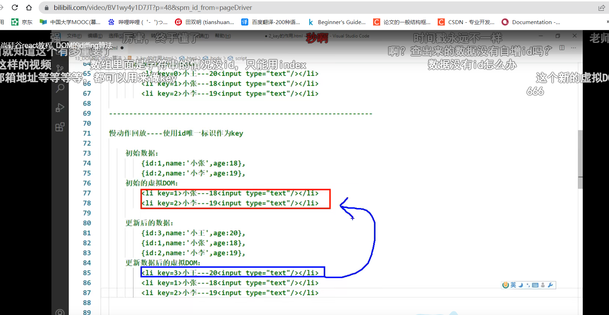

# 路由

hashrouter 有#号 后面的东西不会带给服务器

l路由的跳转：

```jsx
先在入口文件配置：
ReactDOM.render(
  <BrowserRouter>
    <App/>
  </BrowserRouter>,
  document.getElementById('root')
);
```

在路由里面设置路由出口：

```jsx
class index extends Component {
    render() {
        return (
            <div>
                {/* <NavLink activeClassName="xiaoming" to="/user">user</NavLink>&nbsp;&nbsp;&nbsp; */}
                <Switch>
                    <Route path='/home' component={Home}></Route>
                    <Route path='/phone' component={Phone}></Route>
                    <Redirect from='/' to='/home' exact></Redirect>//路由的重定向
                </Switch>
            </div>
        );
    }
}
```

在具体页面设置跳转

```jsx
    fun =()=>{
        this.props.history.push({pathname:'/home',state:{id:12,name:'dahuang'}})//编程式
    }
    render() {
        return (
            <div>
                <div>sadaadad</div>
                {/* <NavLink activeClassName="xiaoming" to="">home</NavLink>&nbsp;&nbsp;&nbsp; */}//导航式
                <button onClick={this.fun}>dddd</button>
                {this.props.location.state.ming}
            </div>
        );
    }
}
```

# 路由传参

```jsx
import React, { Component } from 'react';
// import {NavLink} from 'react-router-dom'
class phone extends Component {
    fun =()=>{
                //编程式--------query传参方式 
        this.props.history.push({pathname:'/home',query:{id:12,name:'dahuang'}})
                //编程式--------state传参方式 不能使用了
        // this.props.history.push({pathname:'/home',state:{id:12,name:'dahuang'}})

    }
    render() {
        return (
            <div>
                <div>sadaadad</div>
                {/* <NavLink activeClassName="xiaoming" to="">home</NavLink>&nbsp;&nbsp;&nbsp; */}
                <button onClick={this.fun}>dddd</button>
                {/* 接受编程式 */}
                {this.props.location.state.ming}  
                
            </div>
        );
    }
}
export default phone;
```


```jsx
import React, { Component } from 'react';
import { NavLink } from "react-router-dom";
class home extends Component {
    render() {
        return (
            <div>
                <div>
                    ddddddddddd
                    {/* 导航式传值 */}
                    <NavLink to={{pathname:'/phone',state:{ming:999999}}}>phone</NavLink>&nbsp;&nbsp;&nbsp; 
                     
                    {/* query方式接收的 */}
                    {this.props.location.query.name}  
                </div>
            </div>
        );
    }
}

export default home;
```

路由NavLink 的封装：

```jsx
import React, { Component } from 'react';
import { NavLink } from "react-router-dom";
class MyNavLink extends Component {
    render() {
        console.log(this.props)
        return (
                <NavLink    {...this.props}>phone</NavLink>
                // <NavLink  公共的一些属性或者样式  {...this.props}>phone</NavLink>
        );
    }
}

export default MyNavLink;
```

switch 精准匹配匹配到第一个之后就不会往下匹配

# 解决样式丢失

原因：多层级路由

解决：1.去掉样式路径前面的点

<<<<<<< HEAD
2. 使用hashRouter

# 路由的模糊匹配与精准匹配

精准匹配：exact 写在理由里面----不能随便写

模糊匹配：跳转的路由顺序与路由开口对应
=======
# HooK

#### state hook

```jsx
创建数据 const [count, setCount] = useState(0);
清除副作用：useffect(()=>{
	setInterval(()=>{
},1000)
},[])------------[]为依赖 当依赖为空的时候可以清除上一个步骤-只执行一次
```

#### useffect返回值

```tsx
return   ()=>{}  //相当于类组建的componnetwillunmount，主要用来一个副作用的销毁
当组件要被销毁的时候执行，他会执行多次


```

#### 副作用操作

```
需要清除的副作用操作：比如定时器、延时器等
不需要清楚的：比如发送的请求
clear 清除副作用的执行会在下一次逻辑执行之前                                                                                                 
   组件的销毁也会执行一次clear
   
```

# useref

```tsx
说明：返回一个可变的ref对象 返回的ref 在组建的整个生命周期内保持不变
语法格式：const myref = useRef();
获取：myref.current
 功能：绑定DOM节点
  const myref = useref()
  <input ref={myref}/>
  <button onclick =(()=>{
  console.log(myref.current)
  })><button/>
    
    
    
```


# useReducer

```tsx
语法：const[state,dispatch] = useReducer(reducer,initial)
useReducer()c参数---1.reducer   2 .状态初始值
返回值：当前state及其配套的dispatch 方法
import React, { useReducer } from 'react';
const reducer1 = (state, action) => {
    switch (action.type) {
        case "increment":

            return state + 1;
        case "decrement":

            return state - 1;

        default:
            return state
    }
}
const Reducer = () => {
    const [count,dispatch] = useReducer(reducer1,0)//0为初始值

    return (
        <div>
            <div>函数组件----{count}</div>
            <button onClick={()=>dispatch({type:'increment'})}>增加</button>
        </div>
    );
};

export default Reducer;
```

# useContext

```tsx
usecontext,能够让我们在函数组件中使用context 的能力 替换之前的contex.consumer 
功能 1.实现从上到下跨多层组件传递数据
	 2.兄弟组件的数据交互，（共享数据）
	 3.配合useReducer组合redux	
第一个-----------
import React, { useContext, useReducer, useState } from 'react';
const reducer1 = (state, action) => {
    switch (action.type) {
        case "increment":

            return state + 1;
        case "decrement":

            return state - 1;

        default:
            return state
    }
}
const myContent = React.createContext()

const Reducer = () => {
    const [count, dispatch] = useReducer(reducer1, 0)//0为初始值
    const [color,setColor] = useState('red')
    return (
        <div>
            <myContent.Provider value={color}>
                <Son></Son>
            </myContent.Provider>
            <div onClick={()=>setColor('pink')}>函数组件----{count}</div>
            <button onClick={() => dispatch({ type: 'increment' })}>增加</button>

        </div>
    );
};
const Son = () => {
    return (
        <div>
            自举荐
            <Sonson></Sonson>
        </div>
        
    )
}
const Sonson = () => {
    const data = useContext(myContent);
    console.log(data);
    return (
        <div>
            <div style={{color:data}}>sun</div>
        </div>
    )
}

export default Reducer;
第二种-----------------------------
 
    
第三种=--------------
数据集组件：
import React, { useReducer} from "react";
export const myContext = React.createContext()
const reducer=(state,action) => {
    switch (action.type) {
        case"add":
            return state+1
        default:
            return state
    }
}
export const Myprovider = ({children})=>{
    const[count,dispatch] = useReducer(reducer,10)
    const value = {//组合共享的数据对象
        count,
        dispatch
    }
    useReducer()
    return <myContext.Provider value={value}>{children}</myContext.Provider>
}
父组件：
import React from 'react';
import SonOne from './son/sonOne';
import SonTwo from './son/sonTwo';
import { Myprovider } from '../information/context';
const user = () => {
    return (
        <div>
            <Myprovider>//用于传递数据使用Myprovider进行包裹
                <SonOne></SonOne>
                <SonTwo></SonTwo>
            </Myprovider>

        </div>
    );
};

export default user;

子组件1
import React, { useContext } from 'react';
import { myContext } from '../../information/context';

const SonOne = () => {
    const {count,dispatch}= useContext(myContext)//dispath 拼写一定要正确，与数据集里面的dispath拼写要一样
    return (
        <div>
            <div>子组件1---------{count}</div>
            <button onClick={()=>dispatch({type:'add'})}>+++</button>
        </div>
    );
};

export default SonOne;
```

>>>>>>> 41ae734e0bb598cb3a5476d80e379894baf22a48

diff算法:
```js
key的作用：
react和vue中的key有什么作用？（key的内部原理是什么）
简单的来说：key是虚拟DOM的标识，在更新时有着及其重要的作用
详细的说：当状态发生改变时，react会根据新数据生成新的虚拟DOM 随后新的虚拟DOM与旧的diff比较，比较规则如下+
    若旧的虚拟DOM内容没有改变，则直接使用之前的真实DOM，若旧的中内容改变了随后替换掉页面中之前的DOM
    旧的虚拟DOM中没有找到于新虚拟DOM相同的key 根据数据创建的新的真是DOM 随后渲染到页面中
为什么遍历列表时最好不用key
用index 作为key可能会引发的问题：
若对数据进行逆序添加删除等破环顺序的操作：会产生没有必要的真实DOM 的更新======>页面没有效果但是效率低
如果界面中还包含输入类的DOM 会产生错误的DOM更新 ============>界面有问题

解决方法：
用数据的唯一标识：数据对象里面的id值



```
#解决样式丢失的问题:
```tsx
更改路由模式，使用哈希router
public/index.html 引入样式的时候不写./ 写 / 或者写 %PUBLIC_URL%
```
精准匹配：
```tsx
<Route exact={true}>//精准匹配
```
#路由重定向
```tsx
写在路由导航的最下面进行兜底
<redirect to='重定向的路径'/>

```
#路由传递参数
```tsx
params 参数
路由连接携带参数：<Link to='/路由路径/参数'>
注册路由声明接受：<Route path='路由路径/:参数名1/:参数名2'>
接受参数 const { 参数名1，参数名2} = this.props.match.params
<Link to={}>
向路由组件传递search 参数
<Link to={`路径/?id=${参数}`}>
无需声明接收
接收参数： 
    使用react 里面的库     
    import qs from 'querystring' 可以解析 urlcoded 编码====>key=value&key=value 形式
取出search 参数
const {search}=this.props.location
const {id,title}=qs.parse(search.slice(1))

向路由组件传递state 参数
<Link to={{pathname:'路由路径'，state:{传递的对象值}}}>
接收state 参数
const {传递的对象key1,传递的对象key2}=this.props.location.state||{}//不加{}容易报错
刷新可以保留参数

```
#push 与replace
```ts
路由的默认模式是push模式
更改的时候在<Link replace>
```
#编程式路由导航
```tsx
this.props.history.replace('路由地址'，{传递对象以键值对方式存在})


```
#简洁语法
```ts
    componentWillUnmount(){
        const {onBack}= NavigatorService.getRouterParams();
        onBack&&onBack()//语法的意义：onback存在并执行onback方法
    }

```