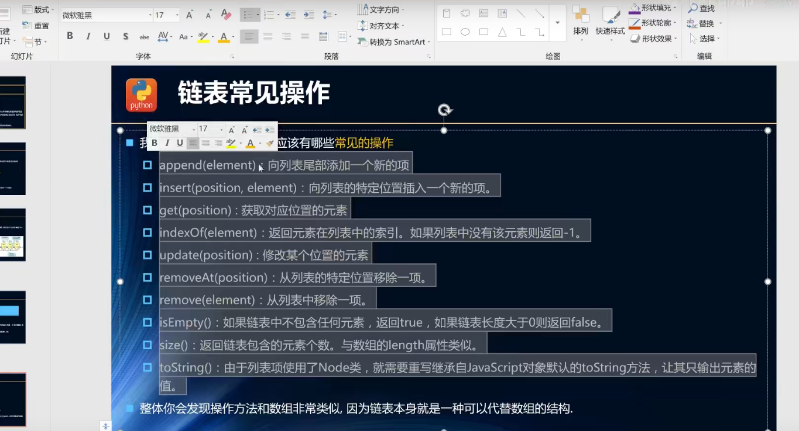

#栈结构
```
是一种线性结构在任意位置可以插入和删除数据
栈结构只能在栈顶操作进栈把新元素放到栈顶，出栈在栈中删除一个元素
递归容易发生栈溢出
栈的面试题
有6个元素6，5，4，3，2，1，的顺序进栈请问下面一个不是合法的出栈顺序（  C  ）
A,543612   B453216   C.346521   D.234156
栈结构的封装（基于数组实现）

```

```js

function x() {
    const arr = [];
    x.prototype.enqueue = function (element) {//队列插入元素
        arr.push(element)
    }
    x.prototype.dequeue = function () {//队列删除元素
        arr.shift()
}
```

#优先级队列
#数组与链表
```
数组与链表一样都是用于存储一系列元素的但是链表与数组的实现方式2完全不同
数组的创建通常需要申请一段内存空间（一整块的1内存空间）并且大小是固定的，数组在开头和中间插入成本高（需要大量的1元素位移）
链表中的元素在内存中不必是连续的空间
链表的每一个元素有一个存储元素本身的节点和一个指向下一个元素的引用（有些语言称为指针或者链接）组成
链表在创建时不必确定大小并且大小可以无线延伸下去
链表插入数据和删除时时间复杂度达到 O（1）相对高效
链表都需要从都开始，无法直接访问


```
